# 그래프
- 트리는 그래프의 한 종류
- 트리는 사이클(cycle)이 없는 하나의 연결 그래프(connected graph)

- 단순히 노드와 그 노드를 연결하는 간선(edge)을 하나로 모아 놓은 것

- 그래프에 방향이 있을 수도 없을 수도 있다.
    - 방향이 있는 경우의 간선: 일방통행
    - 방향이 없는 경우의 간선: 양방향 통행

- 그래프는 여러 개의 고립된 부분 그래프(isolated sub graphs)로 구성될 수 있다.
- 그래프에는 사이클이 있을 수도 없을 수도 있다.
    - 사이클이 없는 그래프를 비순환 그래프(acyclic graph)라고 부른다.

## 그래프를 표현하는 방법
- 인접 리스트
- 인접 행렬

> 인접 리스트

그래프를 표현할 때 사용되는 가장 일반적인 방법

- 모든 `정점(혹은 노드)`을 `인접 리스트`에 저장
    - `무방향 그래프(undirected graph)`에서 (a, b) 간선은 두 번 저장된다.

- `트리`와 다르게 그래프는 특정 노드에서 다른 모든 노드로 접근이 가능하지 않아 `Graph`라는 클래스를 사용한다.

- 그래프를 표현
    - 배열(해시 테이블)과 배열의 각 인덱스마다 존재하는 또 다른 `리스트(배열, 동적 배열, 연결 리스트)`를 이용해서 인접 리스트를 표현한다.
  
> 인접 행렬

- 인접 행렬은 N X N `불린 행렬(boolean matrix)` 또는 `정수 행렬(integer matrix)`을 사용할 수 있다.
  - matrix[i][j]가 true 또는 1인 경우 i에서 j로의 간선이 있다는 뜻이다.

- 무방향 그래프를 인접 행렬로 표현한다면 이 행렬은 `대칭행렬(symmetric matrix)`이 된다.
  - 방향 그래프는 대칭행렬이 안 될 수도 있다.

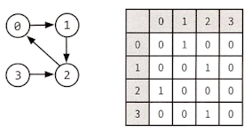

- 인접 리스트를 사용한 그래프 알고리즘들, 예를 들어 `너비 우선 탐색(breadth-first search)` 또한 인접 행렬에서도 사용 가능하다.
    - 인접 행렬은 조금 효율성이 떨어진다.
    - 인접 리스트에서는 어떤 노드에 인접한 노드들을 쉽게 찾을 수 있었다.
    - 하지만 `인접 행렬에서는 어떤 노드에 인접한 노드를 찾기 위해서는 모든 노드를 전부 순회`해야 알 수 있다.

## 그래프의 탐색

그래프를 탐색하는 일반적인 방법 두 가지로는 `깊이 우선 탐색(depth-first search)`과 `너비 우선 탐색(breadth-first search)`이 있다.

- 깊이 우선 탐색(DFS & Recursion)
  - 루트 노드(혹은다른 임의의 노드)에서 시작해서 다음 분기(branch)로 넘어가기 전에 해당 분기를 완벽하게 탐색하는 방법을 말한다.
  - DFS는 a노드를 방문한 뒤 a와 인접한 노드들을 차례로 순회한다.
  - a와 이웃한 노드 b를 방문했다면, a와 인접한 또 다른 노드를 방문하기 전에 b의 이웃 노드들을 전부 방문해야한다. 
  - 즉, b의 분기를 전부 완벽하게 탐색 한 뒤에야 a의 다른 이웃 노드를 방문 할 수 있다는 뜻이다.
  - `전위 순회`를 포함한 다른 형태의 트리 순회는 모두 DFS의 한 종류이다.

  - 그래프에서 깊이 우선 탐색(DFS)의 주의점
      - 그래프 탐색의 경우 어떤 노드를 방문했었는지 여부를 반드시 검사해야 한다는 것이다.
      - 이를 검사하지 않을 경우 무한루프에 빠질 위험이 있다.

  - 깊이 우선탐색 예시(Stack)

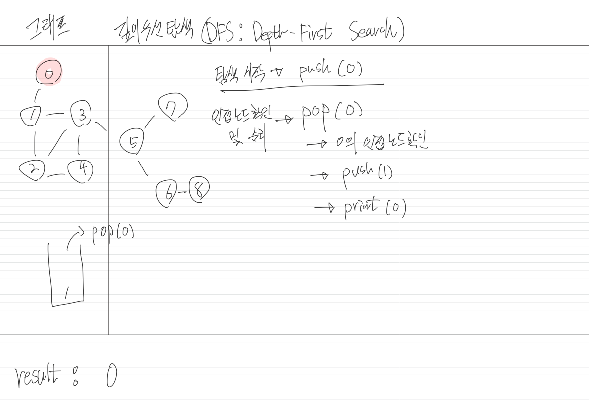
      
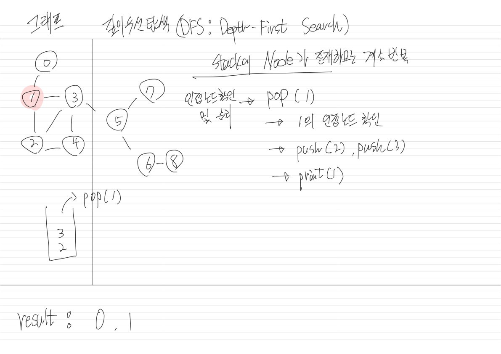

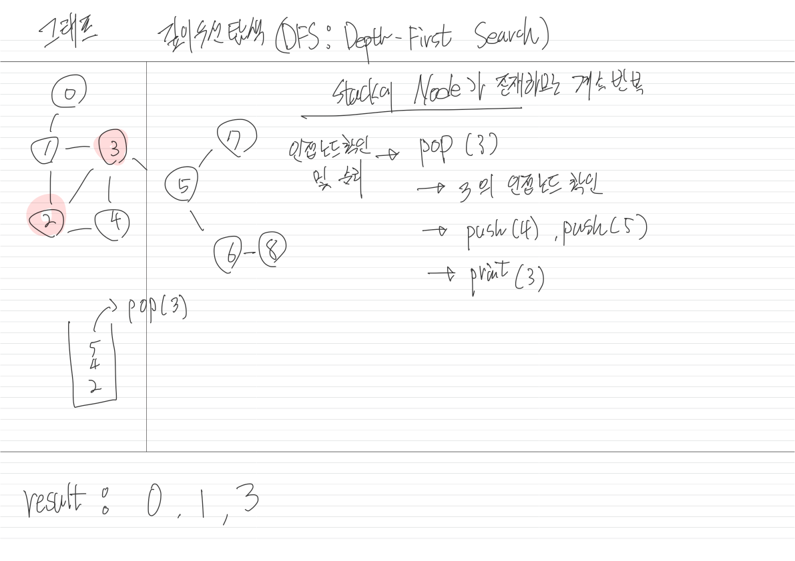

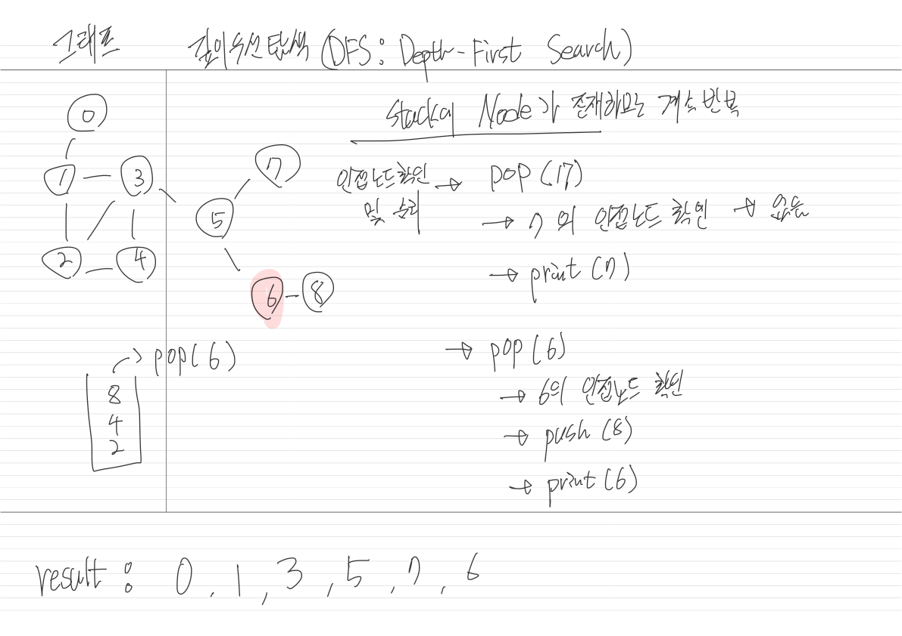

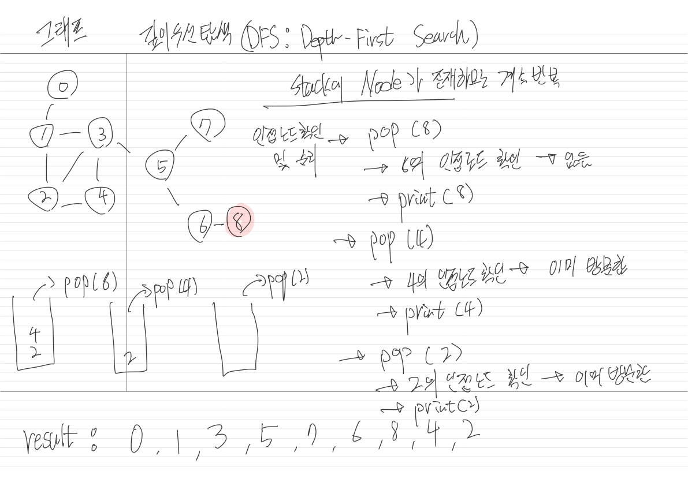

- 너비 우선 탐색(BFS)
  - `루트 노드(혹은다른 임의의 노드)`에서 시작해서 `인접한 노드`를 먼저 탐색하는 방법을 말한다.
  - `BFS`는 재귀적으로 동작하지 않는다.
  - `BFS`는 `큐(queue)`를 사용한다.

  - 탐색 예시
    - a 노드에서 시작한다고 했을 때, BFS는 a노드의 이웃 노드를 모두 방문한 다음에 이웃의 이웃들을 방문한다.
    - 즉, BFS는 a에서 시작해서 거리에 따라 단계별로 탐색한다고 볼 수 있다.

  - 일반적으로 큐를 이용해서 반복적 형태로 구현하는 것이 가장 잘 동작한다.

  - 너비 우선 탐색과 깊이 우선 탐색은 서로 다른 상황에서 사용되는 경향이 있다.
      - DFS는 그래프에서 모든 노드를 방문하고자 할 때 더 선호한다.
      - BFS는 그래프에서 두 노드 사이의 최단 경로 혹은 임의의 경로를 찾으려할 때 선호된다.

  - 너비 우선 탐색 예시(BFS)
  
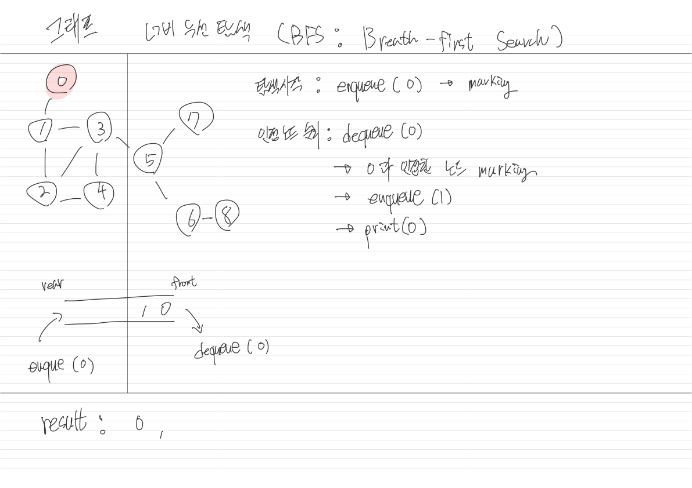

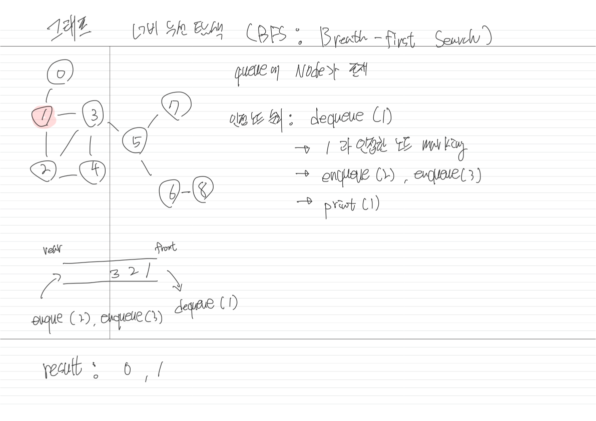

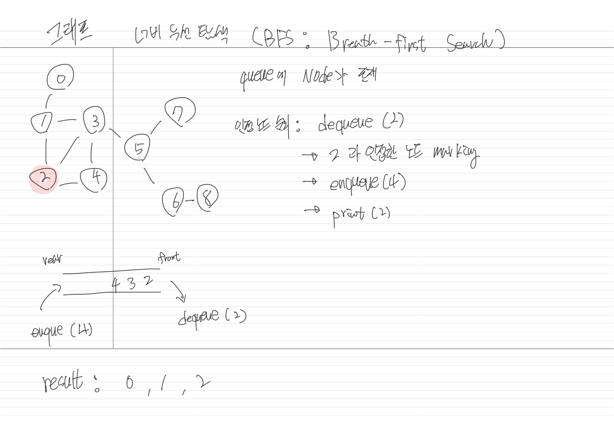

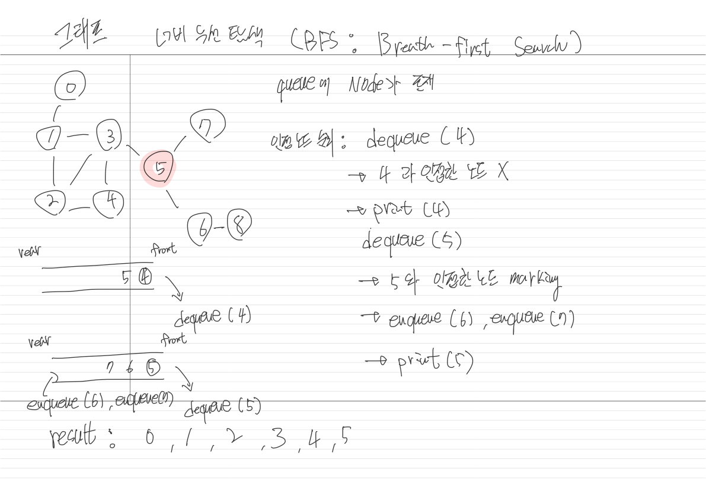

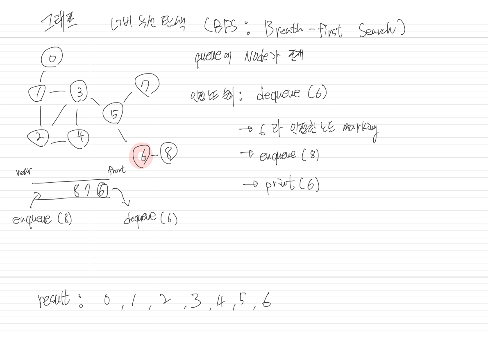

- 양방향 탐색
    - 출발지와 도착지 사이에 최단 경로를 찾을 때 사용되곤 한다.
    - 기본적으로 출발지와 도착지 두 노드에서 동시에 너비 우선 탐색(BFS)을 수행한 뒤, 
      두 탐색 지점이 충돌하는 경우에 경로를 찾는 방식이다.
