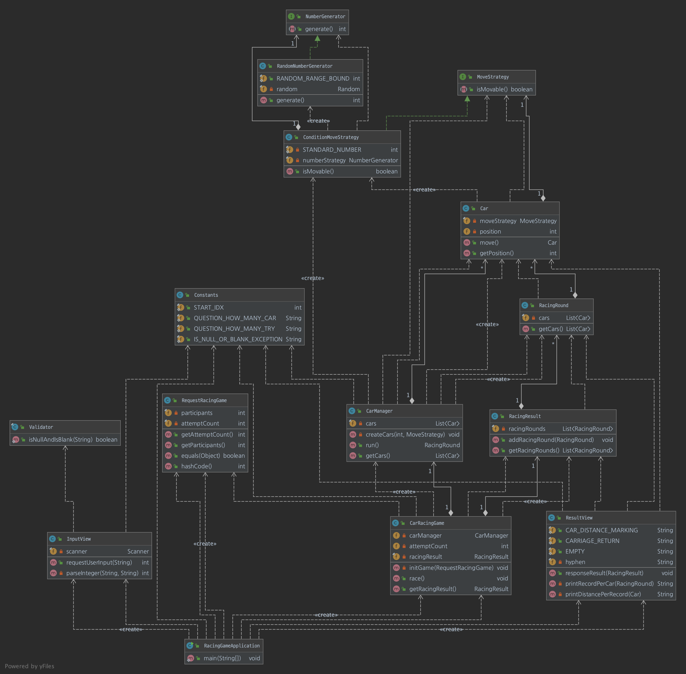
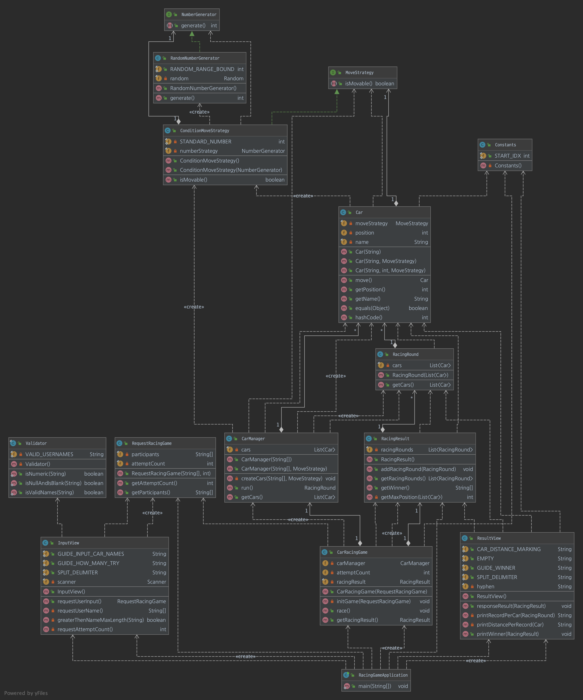
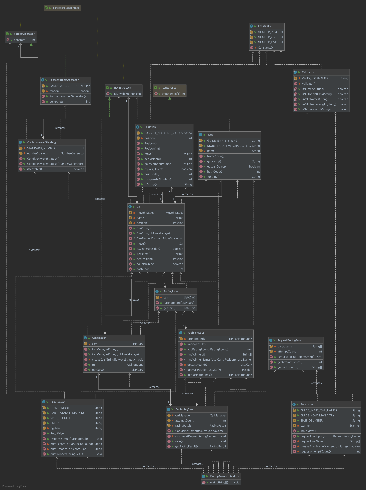

# TDD, Clean Code 11기
개발 습관 개선을 위한 학습

## 자동차 경주
- [x] [1단게 학습 테스트](https://github.com/next-step/java-racingcar/pull/1847#pullrequestreview-601760737)
- [x] [2단계 문자열 계산기](https://github.com/next-step/java-racingcar/pull/1914#pullrequestreview-605336872)
    - enum을 사용한 상태 값과 행위에 대한 코드 응집성 증대
    - 하나의 메서드 안에 15줄 이하로 작성하기

- [x] [3단계 자동차 경주](https://github.com/next-step/java-racingcar/pull/1960#pullrequestreview-607170886)
    - [특정 역할이 없는 코드 삭제](https://github.com/next-step/java-racingcar/pull/1960#discussion_r589048328)
    - [특정 객체에 종속적인 상수는 공통이 아닌 해당 객체에서 관리](https://github.com/next-step/java-racingcar/pull/1960#discussion_r589048600)
    - [연산, 전위 후위 연산자보다 가독성이 좋은 방법 찾기](https://github.com/next-step/java-racingcar/pull/1960#discussion_r589049127)
    - [하나의 메서드에 두 가지 이상 기능으로 인한 가독성, 테스트하기 힘든 코드 개선 필요](https://github.com/next-step/java-racingcar/pull/1960#discussion_r589050223)
    - [클래스명은 명사로 작성하기](https://github.com/next-step/java-racingcar/pull/1960#discussion_r590055725)
    - [메서드명은 동사로 작성하기](https://github.com/next-step/java-racingcar/pull/1960#discussion_r590056162)
    - [public, protected 메서드에 대한 테스트 코드 작성 필요](https://github.com/next-step/java-racingcar/pull/1960#discussion_r590072116)
    - [builder 보다 formatter 사용하기](https://github.com/next-step/java-racingcar/pull/1960#discussion_r590075327)
    - [멤버 변수는 2개까지만 사용하기](https://github.com/next-step/java-racingcar/pull/1960#discussion_r590078081)
    - [객체 비교를 위해 equals, hashcode 작성하기](https://github.com/next-step/java-racingcar/pull/1960#discussion_r590105669)

- [x] [4단계 자동차 경주(우승자)](https://github.com/next-step/java-racingcar/pull/2013)
    - [원시 값을 감싸는 클래스로 만들어 객체를 비교 하는 방식으로 개선](https://github.com/next-step/java-racingcar/pull/2013#pullrequestreview-609736875)
  

- [x] [5단계 자동차 경주(리펙토링)](https://github.com/next-step/java-racingcar/pull/2037)
    - [객체 비교 테스트](https://github.com/next-step/java-racingcar/pull/2037#discussion_r593197783)
    - [메서드 시그니처와 다른 로직](https://github.com/next-step/java-racingcar/pull/2037#discussion_r593202597)
    - [객체의 역할과 책임](https://github.com/next-step/java-racingcar/pull/2037#discussion_r593203847)
  

## 로또
- [x] [1차 문자열 덧셈 계산기](https://github.com/next-step/java-lotto/pull/1242)
  > 1차 피드백
  - [매직넘버란? -> 어려운 리터럴 문자를 쉽게 이해하기 위함인데 상수화가 꼭 필요한지?](https://github.com/next-step/java-lotto/pull/1242#discussion_r594298154)
  - [조건문도 메서드 시그니처를 통해 의미 부여하기](https://github.com/next-step/java-lotto/pull/1242#discussion_r594304155)
  - [getter는 도메인 로직에서 최대한 줄이기](https://github.com/next-step/java-lotto/pull/1242#discussion_r594307685)
  - [요구사항 미흡 (음수 값 예외처리)](https://github.com/next-step/java-lotto/pull/1242#discussion_r594310922)
